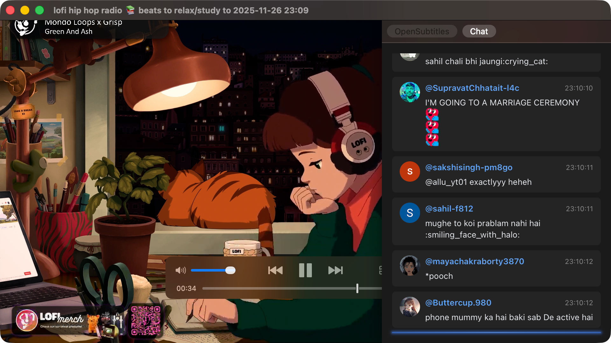

# IINA YouTube Chat

Display YouTube live chat and archived stream chat synchronized with video playback in IINA.




## Features

- **Live Streams**: Fetch and display chat in real-time
- **Archived Streams**: Sync chat with video playback position
- **Rich Display**: Support for Super Chat, memberships, emojis, and more
- **Customizable**: Configure scroll direction, message limit, and display options

## Installation

### Requirements

- [IINA](https://iina.io/) 1.4.0 or later
- [yt-dlp](https://github.com/yt-dlp/yt-dlp) (required for archived stream chat)

### Installing yt-dlp

```bash
# Homebrew (macOS)
brew install yt-dlp
```

### Installing the Plugin

1. Open IINA
1. Go to **Settings** → **Plugins**
1. Select **"Install from GitHub..."**
1. Enter `petamorikei/iina-youtube-chat` and click **Install**

## Usage

Open a YouTube video in IINA, then display chat using one of the following methods:

### Option 1: Sidebar

1. Click the sidebar toggle button
1. Select the **"Chat"** tab
1. Chat will be automatically loaded and displayed

### Option 2: Standalone Window

1. Go to **Plugin** menu → **iina-youtube-chat** → **Open Chat Window**
1. A separate chat window will open

The standalone window is useful when you want to keep chat visible while hiding the sidebar, or position it anywhere on your screen.

### Live Streams

- Chat updates in real-time
- Auto-scrolls to new messages when scrolled to the bottom (or top, depending on settings)

### Archived Streams

- Chat syncs with video seeking (fast-forward/rewind)
- Supports playback speed changes

## Settings

Configure via IINA Settings → Plugins → iina-youtube-chat

| Setting | Description | Default |
|---------|-------------|---------|
| Maximum messages | Max number of messages to display (0 = unlimited) | 200 |
| Scroll direction | Chat scroll direction | Bottom to top |
| Show timestamp | Display message timestamps | ON |
| Show author name | Display author names | ON |
| Show author photo | Display author profile photos | ON |

## Supported Message Types

- Regular text messages
- Super Chat (displayed with colors)
- Super Stickers
- Membership notifications
- Gift memberships
- System messages

## Troubleshooting

### Chat not displaying

- **For archived streams**: Make sure yt-dlp is installed
- **For live streams**: Verify that chat is enabled for the stream
- Regular videos (non-livestreams) do not have chat

### "yt-dlp not found" error

yt-dlp is not installed or not in the system PATH. Install it with:

```bash
brew install yt-dlp
```

---

## For Developers

### Tech Stack

- **React 19** + **TypeScript 5.9**
- **Vite** (rolldown-vite) - Build tool
- **Panda CSS** - Styling
- **TanStack Virtual** - Virtual scrolling
- **Zod** - Schema validation
- **Biome** - Formatter/Linter

### Setup

```bash
# Install dependencies
pnpm install

# Start development server
pnpm dev

# Build
pnpm build

# Code quality check
pnpm check
```

### Project Structure

```
├── plugin/           # IINA plugin entry point
│   ├── entry.ts      # Main entry
│   ├── live-chat-fetcher.ts  # Live chat fetching
│   ├── schemas.ts    # Zod schema definitions
│   └── Info.json     # Plugin metadata
├── src/              # React sidebar UI
│   ├── App.tsx
│   ├── components/
│   └── hooks/
└── dist/             # Build output
```

### Development Plugin Linking

```bash
# Symlink plugin to IINA
iina-plugin link dist/io.github.petamorikei.iina-youtube-chat.iinaplugin

# Unlink
iina-plugin unlink dist/io.github.petamorikei.iina-youtube-chat.iinaplugin
```

### Packaging

```bash
# Generate .iinaplgz file
iina-plugin pack dist/io.github.petamorikei.iina-youtube-chat.iinaplugin
```

## License

MIT License
